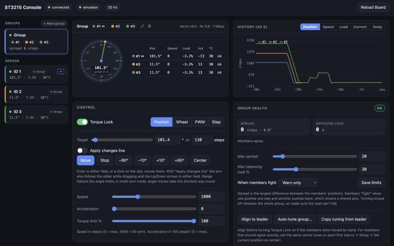

# gosts-ctl: web console

Set up, tune and drive Waveshare ST3215 servos from the browser. An example app of
[Go ST Servo](../../README.md).

<p align="center"></p>

## What you need

- ST3215 servos (other Waveshare/Feetech ST servos should work too).
- A Waveshare Bus Servo Adapter (A), or any USB serial adapter wired to the servo bus.

No hardware? The built-in simulator gives you virtual servos to try everything on.

## Install and run

```bash
go install github.com/frifox/gosts/cmd/gosts-ctl@latest

gosts-ctl                                   # then open http://localhost:8080
gosts-ctl --port /dev/cu.usbmodem1101       # connect and scan on startup (Linux: /dev/ttyACM0)
gosts-ctl --sim 1,2,3                       # simulated servos 1, 2 and 3
gosts-ctl --addr localhost:9000             # serve the page on another address
```

## Getting started

1. **Driver board**: pick your adapter from the list (likely ones are marked) and the baud rate.
2. **Find servos**: a quick scan (IDs 0–20) or a full one (0–253).
3. Pick a servo to see it live: a dial with its position, telemetry and 30-second charts.

## What you can do

- **Drive** a servo in any of its modes: position, wheel (continuous rotation), PWM or step.
- **Setup**: set where 0° is, limit how far it may turn, change its ID, switch multi-turn on.
- **Name** a servo, give it a colour, mark it mirrored, or show its angles as −180…180°
  (the pencil next to its name).
- **Tuning**: the position loop, dead zones, torque and protection. Start from a preset or let
  **Auto…** tune it. **Try** applies until the servo is powered off, **Save** keeps it.
- **Groups** (sidebar → New group): drive two or more servos as one, e.g. a pair facing each other on a
  joint. You see their spread and opposing load, and can have it warn or cut torque if they fight.
  **Align** and **Copy tuning** keep them matched.
- **Memory table**: every register, editable, for when you need it.

Open as many browser windows as you like: they stay in sync.

## Tips

- Only one program can use the serial port: close gosts-ctl before starting another app on the same board
  (e.g. [gosts-rig](../gosts-rig)).
- If live data stutters with several servos, start with `--nosync` (reads the servos one at a time).

Names, colours, groups and ranges are kept in `~/Library/Application Support/gosts-ctl/config.toml` on macOS
(`~/.config/gosts-ctl/` on Linux); `--config` picks another file. Everything else is stored on the servos.
