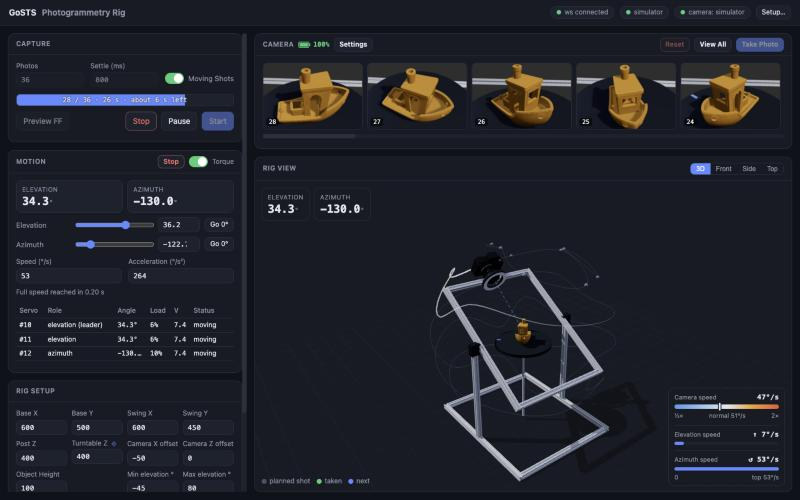

# gosts-rig: photogrammetry rig

Runs a turntable photogrammetry rig from the browser: plan a capture, watch the rig move in 3D, and get the photos
straight off the camera. An example app of [Go ST Servo](../../README.md).



## The rig

- A 600×500 mm base of 2020 extrusions with a post on each long side.
- Two ST3215 servos on the posts tilt a frame carrying the camera: the **elevation**.
- A third ST3215 turns the platform under the object: the **azimuth**.
- A camera on USB that [gphoto2](http://gphoto.org) can drive (developed with a Sony A6600 in PC Remote mode).

No hardware? The simulator stands in for the rig, the camera, or both.

## Install and run

```bash
brew install gphoto2                        # for a real camera
go install github.com/frifox/gosts/cmd/gosts-rig@latest

gosts-rig                                   # then open http://localhost:8081
gosts-rig -sim -camera sim                  # simulated rig and camera
```

## First time

1. Set up the servos with [gosts-ctl](../gosts-ctl) first: IDs, tuning, and zero (elevation 0° = camera level with
   the object, azimuth 0° = the platform's front). Close it after: only one program can use the serial port.
2. In gosts-rig, **Setup** picks which servo does what (by default #10 and #11 elevation, #12 azimuth).
3. **Rig Setup** takes your rig's measurements and how low and high the camera may go.
4. Set the camera to **RAW & JPEG** (on a Sony in PC Remote: save to PC+Camera). The RAWs stay on the card,
   and only the JPEGs come over USB.

## Taking photos

- **Capture**: choose how many photos you want. They're spread evenly round the object, as high and low as the
  camera may go.
- **Moving Shots**: the rig doesn't stop for each photo. It glides along one smooth spiral instead, which is much
  faster, for a quick enough shutter. Any number of photos works; on long spirals the rig pauses for a moment now
  and then to reset the platform servo's turn count.
- **Preview** plays the capture in the 3D view first, without moving the rig.
- **Start**, **Pause**, **Stop**. The progress bar shows the photos done and about how long is left.
- **Take Photo** takes a single photo where the rig is.

Photos appear in the Camera card as they arrive. Click one to see it full size, **View All** for a grid. They're
saved in `~/Pictures/gosts-rig/`, a folder per batch named after its start time. **Reset** starts a new batch.

## Camera settings

**Settings** (in the Camera card's title) opens the camera's settings next to a sample shot.

- Shutter, f-stop, ISO, white balance and focus, applied as you change them. **Take Sample Shot** shows how
  they look.
- **Detect** next to the f-stop finds the range your lens really has (about half a minute).
- Next to the f-stop: the **depth of field**, how deep the sharp zone is, for where the object sits on the rig.
- **Gray Card** (with white balance on a colour temperature): drag a box over a gray card in the sample. It
  suggests the colour temperature and colour shifts that make the card neutral, a button each to apply.
- **Focus** (in Manual focus): drag a box over the part that matters to see it large. **Auto** focuses on that
  part for you; the arrows nudge the focus nearer or further. Focus stays where you leave it for the capture.

## Tips

- *"Another program has the camera"* (macOS): quit Photos and Image Capture, then run
  `killall ptpcamerad mscamerad-xpc`.
- Use **Manual** focus for captures: in an autofocus mode the camera won't fire until it has found focus.
- The battery level is shown next to the Camera card's title.

Settings are kept in `~/Library/Application Support/gosts-rig/config.toml` on macOS (`~/.config/gosts-rig/` on
Linux); `-config` picks another file.
